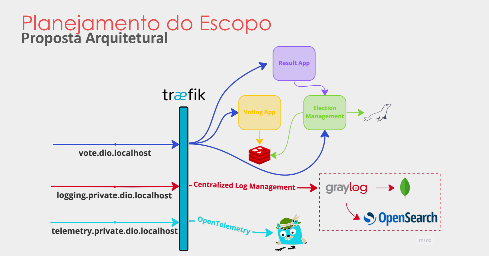

# Lab Quarkus - Sistema de Eleição

Repositório do laboratório Sistema de Eleição usando Quarkus Framework, com orientação do expert [Thiago Poiani](https://gitub.com/thpoiani) pela DIO.

## Visão Geral do Projeto

Esse projeto é composto por 3 aplicações de negócio principais:

- [Election Management](./election-management): Gerenciamento da eleição e adicionar candidatos.
- [Voting App](./voting-app): Interface para eleitores votarem.
- [Result app](./result-app): Análise dos resultados da eleição.

Além disso, foram utilizadas tecnologias para métricas e observabilidade. 

